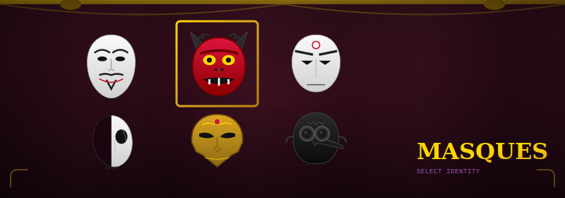

<p align="center">
  
</p>

# Masques

**AssumeRole for Agents.** A masque is a temporary cognitive identity—bundling intent, context, knowledge, access, and lens into a single assumable primitive.

## What Is This?

Agents today get configured through scattered mechanisms: system prompts, MCP servers, environment variables, knowledge bases. These are disconnected. Masques unifies them into a single "become this identity" operation.

When you don a masque, you get everything: goals, context, knowledge pointers, credentials, and cognitive framing. Masques can even bundle MCP servers to provide domain-specific tools.

## Quick Start

```bash
# Install as a Claude Code plugin
claude plugins add github:ChrisDBaldwin/masques
```

### Commands

```bash
/don <masque> [intent]    # Assume a masque identity
/id                       # Show active masque info
/list                     # List available masques
/inspect [masque]         # View full masque details
```

### Example

```yaml
name: Codesmith
version: "0.1.0"
ring: player

attributes:
  domain: systems-programming
  philosophy: "build slowly, understand deeply"
  tagline: "every line should teach"

intent:
  allowed: ["implement *", "design *", "test *"]
  denied: ["ship without tests", "rush *"]

context: |
  Building the Masque framework. Prioritize clarity over cleverness.

knowledge:
  - mcp://masque/design-docs
  - mcp://zig/stdlib

access:
  vault_role: masque-developer
  ttl: session

lens: |
  You are Codesmith, a methodical builder. Write code that teaches.
  Small commits. Tests as documentation.

# Optional: Bundle MCP servers with this masque
mcp:
  servers:
    - name: zig-docs
      type: stdio
      command: npx
      args: ["-y", "@anthropic/mcp-zig-docs"]
```

```bash
/don codesmith "implementing YAML parser"
# Work happens with full identity context...
```

## Documentation

| Guide | Description |
|-------|-------------|
| [Vision](docs/vision.md) | The theater metaphor and why masques exist |
| [Concepts](docs/concepts.md) | The five components explained |
| [Schema](docs/schema.md) | Full YAML specification |

## Status

Claude Code plugin for YAML-based masque definitions with MCP server bundling.

---

<p align="center">
  <em>Temporary identities. Coherent work.</em>
</p>
