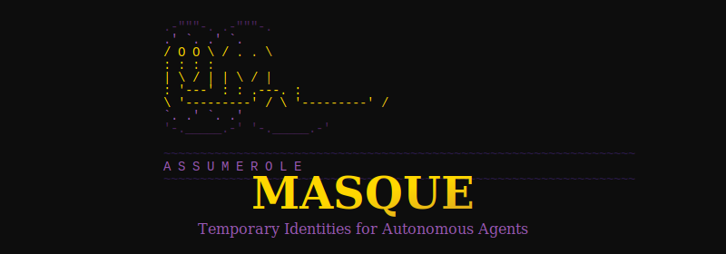

<p align="center">
  
</p>

# Masque

**AssumeRole for Agents.** A masque is a temporary cognitive identity—bundling intent, context, knowledge, access, and lens into a single assumable primitive.

## What Is This?

Agents today get configured through scattered mechanisms: system prompts, MCP servers, environment variables, knowledge bases. These are disconnected. Masque unifies them into a single "become this identity" operation.

When you don a masque, you get everything: goals, context, knowledge pointers, credentials, and cognitive framing. When the session ends, credentials expire—but work product remains.

## Quick Start

```bash
# Install as a Claude Code plugin
claude plugins add github:ChrisDBaldwin/Masque

# Or from source
git clone https://github.com/ChrisDBaldwin/Masque.git
cd Masque && zig build
```

### Commands

```bash
/don <masque> [intent]    # Assume a masque identity
/doff                     # Release current masque
/whoami                   # Show active masque info
```

### Example

```yaml
name: Codesmith
version: "0.1.0"
ring: player

intent:
  allowed: ["implement *", "design *", "test *"]
  denied: ["ship without tests", "rush *"]

context: |
  Building the Masque framework in Zig. Prioritize clarity over cleverness.

knowledge:
  - mcp://masque/design-docs
  - mcp://zig/stdlib

access:
  vault_role: masque-developer
  ttl: session

lens: |
  You are Codesmith, a methodical builder. Write code that teaches.
  Small commits. Tests as documentation.
```

```bash
/don codesmith "implementing YAML parser"
# Work happens with full identity context...
/doff
```

## Documentation

| Guide | Description |
|-------|-------------|
| [Vision](docs/vision.md) | The theater metaphor and why masques exist |
| [Concepts](docs/concepts.md) | The five components explained |
| [Trust Rings](docs/trust-rings.md) | Continuous qualification model |
| [Teams](docs/teams.md) | Multi-agent coordination patterns |
| [Implementation](docs/implementation.md) | Masques as programs |
| [Schema](docs/schema.md) | Full YAML specification |
| [Reflection](docs/reflection.md) | Observability model |

## Status

Zig CLI implemented. Claude Code plugin packaged with prebuilt darwin-arm64 binaries.

---

<p align="center">
  <em>Temporary identities. Coherent work.</em>
</p>
