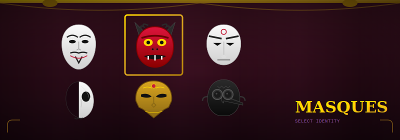

<p align="center">
  
</p>

# Masques

**AssumeRole for Agents.** A masque is a temporary cognitive identity—bundling lens (how to think), context (who you're helping), and attributes (metadata) into a single assumable primitive.

## What Is This?

Agents today get configured through scattered mechanisms: system prompts, MCP servers, environment variables, knowledge bases. These are disconnected. Masques unifies them into a single "become this identity" operation.

It's a representation layer you slap on top of any agent: don a masque to adopt its lens and context, do the work, then doff to step backstage and return to baseline. The core needs **zero infrastructure** — a masque is just YAML, and identity lives in a session file. The [roadmap](#roadmap) sketches where this could grow — bundled knowledge, credentials, and tools.

## How It Works

The core loop needs no databases, no services, no credentials — just YAML and a session file:

```
Don   → read masque YAML, inject lens + context, write .claude/masque.session.yaml
Work  → operate with the masque's framing
Doff  → clear the session, return to baseline Claude
```

That's the whole product. **Optionally**, OTEL telemetry can score how a session went — entirely opt-in, with two databases, neither required to use a masque:

| Engine | Role | Data |
|--------|------|------|
| **ClickHouse** | Analytics *(optional)* | Telemetry from OTEL collector |
| **DuckDB** | Local scoring *(optional)* | Session performance from OTEL JSONL exports |

## Quick Start

```bash
# Install as a Claude Code plugin
claude plugins add github:ChrisDBaldwin/masques
```

### Commands

```bash
/don <masque> [intent]    # Assume a masque identity
/doff                     # Return to baseline Claude
/id                       # Show active masque info
/list                     # List available masques
/inspect [masque]         # View full masque details
/sync-manifest [scope]    # Regenerate manifest files
/audience [action]        # Manage telemetry (start/stop/status/config/logs)
/performance              # Score masque session performance
```

## Schema

A masque bundles cognitive identity into a single YAML file:

```yaml
name: string              # Required. Human-readable name
version: "x.y.z"          # Required. Semantic version

attributes:               # Optional. Flexible metadata
  domain: string
  tagline: string
  style: string
  philosophy: string

context: |                # Optional. Situational framing
  Who you're helping, what they value, operational environment.

lens: |                   # Required. Cognitive framing (system prompt fragment)
  How to approach problems. What to prioritize. What to reject.

spinnerVerbs:             # Optional. Custom activity indicators
  mode: replace           # replace | append | prepend
  verbs:
    - "Masque:Verbing"
```

See [Schema Reference](docs/schema.md) for the full specification.

## Services

### OTEL Collector

Receives metrics and logs from Claude Code sessions via OTLP, exports to ClickHouse (remote analytics) and local JSONL (DuckDB scoring).

```bash
cd services/collector
docker compose up -d      # Start collector
# Configure via .env — see .env.example
```

### Performance Judge (DuckDB)

Scores masque sessions across 5 dimensions from local OTEL exports:

- **Quality** (30%) — tool success rate
- **Autonomy** (25%) — agent actions per user prompt
- **Productivity** (20%) — tool completions per minute
- **Token Efficiency** (15%) — cache hit ratio
- **Cost Efficiency** (10%) — cost per tool completion

```bash
services/judge/judge.sh   # Outputs YAML score to stdout
```

### ClickHouse (optional)

An optional remote analytics sink for OTEL data. The collector ships metrics and logs to ClickHouse and auto-creates its schema (`create_schema: true`) — no migrations to run. Configure via the collector's `.env`; leave it unset to keep everything local.

## TUI — Masque

Terminal UI for browsing masques and drafting teams. Built with Zig 0.16+ and [libvaxis](https://github.com/rockorager/libvaxis).

```bash
cd tui && zig build run   # build and launch
# or: zig build && ./zig-out/bin/masques
```

- Animated portraits with domain-specific patterns (forge, cybernetic, art, etc.)
- Theatrical mask silhouettes per category — sovereign (executive), cerebral (cognitive), classic (specialist), theatrical (art), geometric (meta)
- Full lens text, attributes, and metadata in the detail panel
- Team drafting with role assignment and YAML export

Navigate with arrow keys, `Enter` to add to team, `Tab` to switch focus, `1`–`6` for category tabs, `q` to quit.

## Roadmap

Masques is the **identity layer** for any agent. Today it provides cognitive framing (lens, context, attributes) and telemetry-based scoring. The minimal product stops there. Possible future integration:

| Need | Status | Why | Approach |
|------|--------|-----|----------|
| Telemetry | **Working** | Measure what masques actually do | OTEL → Collector → ClickHouse + DuckDB |
| Knowledge | Planned | Masques should bring their own context | MCP URIs bundled per masque |
| Credentials | Planned | Identity implies access | Vault role + TTL declarations |
| Tools | Planned | Masques should bring their own capabilities | Bundled MCP servers per masque |

The larger "agent marketplace" direction — spawning masques as paid workers with a reputation + payment gate — is deferred. See [`docs/future/`](docs/future/) for that vision.

## Documentation

| Guide | Description |
|-------|-------------|
| [Getting Started](docs/getting-started.md) | Create your first masque in 5 minutes |
| [Vision](docs/vision.md) | The theater metaphor and why masques exist |
| [Concepts](docs/concepts.md) | The five components explained |
| [Schema](docs/schema.md) | Full YAML specification |
| [OTEL Setup](docs/otel-setup.md) | Configuring the telemetry pipeline |
| [Evaluation](docs/evaluation.md) | DuckDB session scoring |
| [Evaluations](evals/README.md) | Testing masque behavioral fidelity |
| [Future](docs/future/) | Deferred vision — agent marketplace, payments |
| [TUI](tui/) | Masque — terminal UI for browsing and team drafting |

## Contributing

Contributions welcome! Please read [CONTRIBUTING.md](CONTRIBUTING.md) before starting.

**The process:** Open an issue first, then fork, branch, and submit a PR referencing that issue.

## Support

This is a personal project maintained in spare time. For bugs, please [open an issue](https://github.com/ChrisDBaldwin/masques/issues/new?template=bug_report.md) with:

- What you tried and what happened
- A screenshot or GIF of the experience (really helps!)
- Your environment details

## Status

A Claude Code plugin for donning cognitive identities, a library of 35 masques, and a Zig TUI for team drafting. The core is infrastructure-free; telemetry (OTEL → optional ClickHouse + DuckDB scoring) is opt-in. Payment/marketplace infrastructure is deferred (see [`docs/future/`](docs/future/)).

---

<p align="center">
  <em>Temporary identities. Coherent work. Measured performance.</em>
</p>
